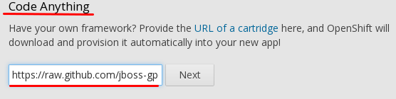
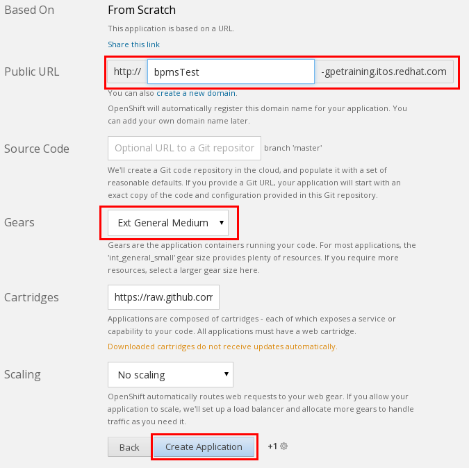
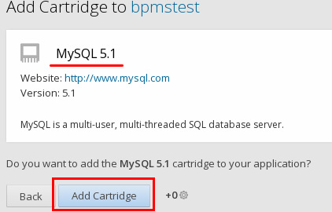

:data-uri:
:toc2:
:jbossbpmsoarpmbuild: link:https://github.com/jboss-gpe-ose/jboss_bpm_soa_rpmbuild[jboss_bpm_soa_rpmbuild]
:bpmsmysqlrpmbuild}: link:https://github.com/jboss-gpe-ose/mysql_module_rpmbuild[bpms_mysql_rpmbuild]
:bpmsrpmbuild: link:https://github.com/jboss-gpe-ose/bpms_rpmbuild[bpms_rpmbuild]
:rhctools: link:https://access.redhat.com/site/documentation//en-US/OpenShift_Enterprise/2/html/Client_Tools_Installation_Guide/chap-OpenShift_Client_Tools.html[RHC Tools]
:partnercenter: link:https://www.redhat.com/wapps/sfconnector/partner/login.html[RHT Partner Center]

image::images/rhheader.png[width=900]

:numbered!:
[abstract]
== openshift-origin-cartridge-bpms-full

== Summary:

. This project provides a community developed Openshift Enterprise 2.0 cartridge for BPM Suite 6.
This  _downloadable_ cartridge will only work in on-premise Openshift Enterprise environments where a few custom, non-Red Hat-supported "ghetto" RPMs can be installed.  
So, for instance, this cartridge will not work on any service plan offered by Openshift Online.
. The purpose of these custom, non-supported RPMs that this BPMS6 cartridge depends on is to pre-install JBoss EAP6.1.1 and BPMS6.0.0.GA on each Openshift node.  
The benefit of this approach is that these bits do not need to be bundled in the downloadable cartridge itself. 
Subsequently, creating a new BPMS6 application in Openshift Enterprise can occur quickly.  
Quick provisioning of BPMS6 environments may prove valuable in scenarios where you may need many instances of BPMS6.
. This cartridge does not rely on the JBoss EAP available through the jbappplatform channel of the Red Hat Network.  
The release cycle of JBoss EAP from that channel is not in sync with releases of BPM Suite 6  
ie:  to-date, the version of EAP available from the jbappplatform channel is 6.2.  
BPM Suite 6 has a hard-requirement on EAP 6.1.1 specifically.
. Red Hat has other active initiatives to create a supported BPMS6 cartridge.  
Please contact your Red Hat sales representative for more details regarding these supported options.
. This cartridge assumes co-installation of the mysql Openshift cartridge.  
Subsequently, BPMS6 is configured to leverage the jbpm database of mysql rather than H2.

== Pre-Requisities:
. An Openshift Enterprise 2.0 environment installed with the following custom RPMs:
.. {jbossbpmsoarpmbuild}
.. {bpmsmysqlrpmbuild}
.. {bpmsrpmbuild}
. Your Openshift Enterprise 2.0 needs to support medium sized gears (ie:  1G of RAM and 1G of disk space per gear).  
It's highly recommended that a district be created in your Openshift Enterprise environment so that gears can be freely moved from one node to another.
. {rhctools} installed in your local environment

[IMPORTANT]
Red Hat's _Partner Demonstration System_ provides Red Hat partners with freely available Openshift Enterprise environment that already meet the first two pre-requisites.
If you are a Red Hat Partner, please visit {partnercenter} for more details. 

== Getting Started:
Once the above pre-reqs are met, provisioning of a BPMS6 environment is easy.  
You have the following two options:

=== Provision via rhc tooling 

Execute the following at the command-line of your local environment:

-----
rhc app create bpms_test https://raw.github.com/jboss-gpe-ose/openshift-origin-cartridge-bpms-full/master/metadata/manifest.yml mysql -g mediumplus --no-git --noprompt
-----

[NOTE]
when executed, this command creates a gear using the previously defined size of ext_general_medium containing both the bpms6 and mysql cartridges.  
In addition, it does not attempt to clone the new gear's git repository to a local environment nor does it prompt you for anything else such as upload of ssh keys.

=== Provision via OSE Admin Console:

. Log into the Administrative Console of your Openshift Enterprise environment.
. Navigate to:  Applications --&gt; New Application
. Scroll to the bottom of the page enter the following URL into the Code Anything text box:

-----
https://raw.github.com/jboss-gpe-ose/openshift-origin-cartridge-bpms-full/master/metadata/manifest.yml
-----

. click:  Next

. Provide the application a name by adding a value in the:  Public URL text box.
. Select the gear type as provided by your Openshift Enterprise environment.  

[NOTE]
should be at minimum a medium sized gear

. Click:  Create Application
. In a short bit, the Admin console will redirect to a page that includes a URL to:  Continue to the application overview page.  Click that URL.
. The next page allows for the addition of a mysql database cartridge to the gear.  Select the Add Mysql 5.1 link.

[start=4]
. bounce the gear
.. ssh into your gear 
.. execute:  ctl_app stop
.. execute:  ctl_app start

=== Login to BPM Central
Using the gear info provided by Openshift, you should now be able to point your browser to the following URL to access the BPM Central web application:

http://<openshift_server_address>/business-central

userid / passwd = jboss/brms

== Technical Topics:

=== Version of BPM Suite 6:

 jboss-bpms-6.0.1.GA-redhat-4-deployable-eap6

=== Use of MySQL
An embedded H2 database comes default with BPMS6.  
This BPMS6 cartridge will use that default embedded H2 database unless it detects that a MySQL cartridge has been added to the Openshift application.
In particular, MySQL is used to maintain both JBPM engine and Business Activity Monitoring tables.  
MySQL was selected because in a 'scaled' openshift app, a single mysql database instance could be shared across multiple bpms6 run-time instances.  
Ultimately what's envisioned is a 'BPMS Process Engine' cartridge that would allow for scalable small-gear bpms6 process engine apps that share a single mysql database.
A "BPMS Process Engine" cartridge has not been completed yet but work is in progress.

[NOTE]
A future version of this cartridge will allow for selection of various supported RDBMSs rather than being hard-coded to use mysql.

=== Run-time Footpint:
An Openshift app provisioned with this cartridge will have about a 600+MB heap footprint.  
Thus, at a minimum, a medium-sized Openshift gear is required.  
It has been demonstrated however that a customized BPMS environment that only includes the process engine (ie:  no business-central or dashbuilder) has a run-time heap footprint of about 350MB.  
This "BPM Process Engine" app fits comfortably in an Openshift small gear.

=== BPMS6 git repositories :
Embedded in the BPMS6 business-central web app is both a read-only git-protocol daemon as well as a read-write ssh based daemon to allow for interaction with its git repositories from remote clients.  
This functionality is described nicely in Eric Shabell's post.
The hurdles with these daemons in openshift are  two-fold:

* odd problem where ssh daemons from 2 or more  BPMS gears installed on same OSE node conflict with each-other (BindException:  Address already in use).
** this is after explicitly instructing the SSH daemons to bind to different IP addresses.
** For now i just have the ssh and git daemons disabled in the bpms6 cartridge.  This needs to be investigated further.
*  port 8001 (for ssh) and 9418 (for git protocol) are non-standard Openshift ports.
** assuming the BindException problem described previously is resolved, a user of this cartridge will need to set-up port-forwarding of these ports.

Subsequently, the only current mechanism to interact with the biz-central git repository in an Openshift environment provisioned with this cartridge is to do so directly, ie:  via the bare git repositories found in the .niogit directory.  
Yes, i know this approach is not recommended by the bpms6 engineering team.  
However, this approach works fine and does utilize standard git tools and work-flow.
This cartridge sets the org.uberfire.nio.git.dir system property to:  $OPENSHIFT_DATA_DIR/bpmsGit.
Read-write access to the bare git repos in this directory is available via the standard port 22 ssh daemon provided by the Openshift gear (subsequently:  no port-forwarding required).
ie:  cloning of an existing, remote, Openshift-hosted, bare, biz-central, git repo could be as follows from a local client :

-----
git clone 52f17c0325535d0133000058@bpms-gpetraining.itos.redhat.com/~/app-root/data/bpmsGit/.niogit/insurancepolicy.git
-----

After cloning, your now local git-based working project will have a ssh-based reference to this remote biz central bare repo.
Read/write access is provided to your client via the standard RSA public-key authentication that occurs with standard port-22 ssh to your Openshift gear.

=== JBoss EAP Management Console
Specific to this cartridge, the JBoss Management Console is available at the following URL with-out the need for port-forwarding:

-----
http://<openshift_server_address>/console
-----
